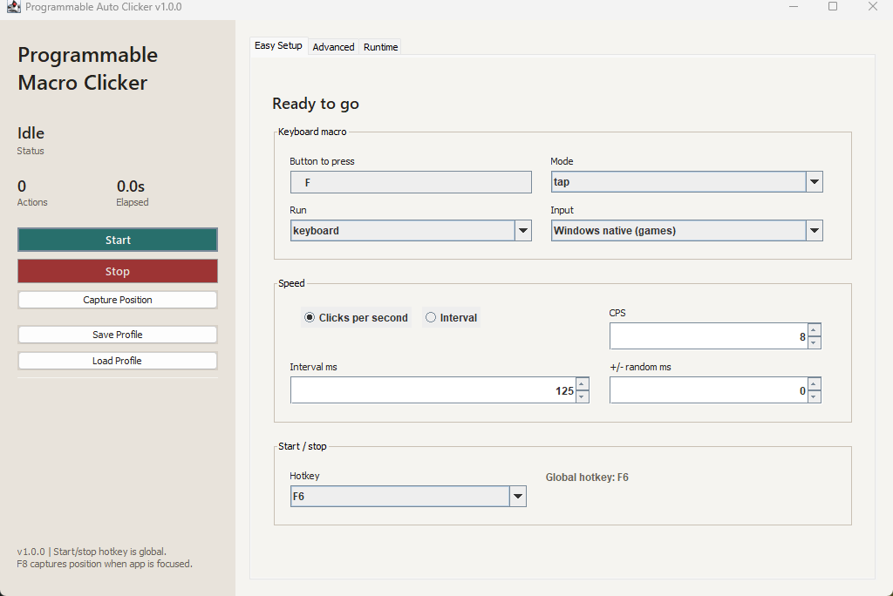

# Programmable Auto Clicker

[](https://github.com/RyanVerWey/programmable-auto-clicker/actions/workflows/build.yml)
[](https://github.com/RyanVerWey/programmable-auto-clicker/releases/latest)
[](LICENSE)
[](#requirements)

A compact Windows desktop app for configurable keyboard and mouse automation.
It supports native Windows input for games and a Java Robot fallback for
ordinary desktop applications. The portable release includes its own Java
runtime, stores no telemetry, and does not require installation.



## Download

1. Open the [latest release](https://github.com/RyanVerWey/programmable-auto-clicker/releases/latest).
2. Download `ProgrammableAutoClicker-v1.0.0-windows-x64.zip`.
3. Extract the entire ZIP to a normal folder.
4. Run `ProgrammableAutoClicker.exe` inside the extracted folder.

Do not run the EXE from inside the ZIP. The executable needs the adjacent
`app` and `runtime` folders.

The release is not code-signed, so Windows SmartScreen may show an
"unrecognized app" warning. Verify the downloaded file with the published
`.sha256` checksum before running it.

```powershell
Get-FileHash .\ProgrammableAutoClicker-v1.0.0-windows-x64.zip -Algorithm SHA256
```

The resulting hash should match the value in the release's
`ProgrammableAutoClicker-v1.0.0-windows-x64.zip.sha256` file.

## Quick Start

The default profile is ready for rapid `F` key input:

- Action: keyboard
- Key: `F`
- Speed: 8 actions per second
- Key hold: 50 ms
- Input: Windows native
- Global start/stop hotkey: `F6`

To use it:

1. Open the target application.
2. Open Programmable Auto Clicker and confirm the settings.
3. Return to the target application.
4. Press `F6` to start.
5. Press `F6` again to stop.

Move the mouse to the top-left corner to trigger the fail-safe when it is
enabled. The on-screen elapsed timer freezes when automation stops and resets
when a new run starts.

## Features

### Keyboard Automation

- Capture almost any keyboard key directly from the UI
- Tap, hold, and burst modes
- Configurable hold duration, burst count, and burst gap
- Windows scan-code input through `SendInput`
- Java Robot fallback for desktop applications

### Mouse Automation

- Left, right, and middle mouse buttons
- Single, double, hold, and burst modes
- Current cursor, fixed coordinate, or random rectangle targeting
- Configurable per-action position jitter
- One-click current-position capture

### Timing And Runtime Controls

- Actions per second or exact interval mode
- Live speed changes while automation is running
- Configurable timing jitter
- Optional start delay
- Manual, duration, or action-count stop conditions
- Random breaks after randomized action counts
- Live action count, elapsed time, and status

### Profiles And Safety

- Save and load reusable `.profile` files
- Configurable global start/stop hotkey from `F6` through `F12`
- Focused-window `F7` emergency stop
- Focused-window `F8` position capture
- Optional top-left-corner fail-safe
- Input validation before a run starts

## Using The App

### Easy Setup

Use this tab for the common keyboard workflow:

1. Click **Button to press**, then press the key to automate.
2. Select tap, hold, or burst mode.
3. Choose **Windows native (games)** or **Java Robot (desktop)**.
4. Set actions per second or an exact interval.
5. Choose a global start/stop hotkey.

### Advanced

Use this tab to configure random mouse bounds, click timing, key hold duration,
and burst behavior.

### Runtime

Use this tab to select mouse target behavior, stop conditions, random breaks,
position jitter, and the top-left-corner fail-safe.

### Profiles

**Save Profile** writes every current setting to a readable `.profile` file.
**Load Profile** restores those settings. Profiles are local files and are
never uploaded.

## Input Modes

**Windows native (games)** uses the Windows `SendInput` API. Keyboard events
are sent as hardware scan codes, which improves compatibility with
frame-polled applications.

**Java Robot (desktop)** uses Java's standard desktop automation API. It is a
useful fallback for browsers, office applications, and other ordinary Windows
programs.

Some applications intentionally reject synthetic input. This project does not
bypass anti-cheat, security controls, or application input policies.

## Troubleshooting

### Input Works On The Desktop But Not In A Game

- Select **Windows native (games)**.
- Increase keyboard hold time to 40-80 ms.
- Run the clicker at the same Windows privilege level as the target.
- Confirm the target accepts `SendInput`; some protected applications do not.
- Test at a low rate before increasing actions per second.

### The Global Hotkey Is Unavailable

Another application may already own that key. Select a different hotkey from
`F6` through `F12`, or keep the clicker focused and use its Start/Stop buttons.

### Speed Does Not Match The Selected Rate

The configured interval is measured from one action start to the next. Hold
time is included in that interval. Extremely long holds cannot complete faster
than the hold itself.

### The App Does Not Start

- Extract the complete release ZIP before launching.
- Keep the EXE beside its generated `app` and `runtime` folders.
- On ARM Windows, use x64 emulation.
- Check whether endpoint security quarantined an unsigned executable.

## Requirements

### Portable Release

- Windows 10 or Windows 11
- x64 processor, or Windows x64 emulation on ARM
- No separate Java installation required

### Building From Source

- Windows PowerShell 5.1 or PowerShell 7
- JDK 21 or newer with `javac`, `jar`, and `jpackage`
- Internet access on the first build to download JNA 5.19.1
- Optional: WiX Toolset for MSI generation

```powershell
git clone https://github.com/RyanVerWey/programmable-auto-clicker.git
cd programmable-auto-clicker
.\test.ps1
.\package.ps1
.\verify-release.ps1
```

Build output:

- `out\ProgrammableAutoClicker.jar`: development JAR
- `dist\ProgrammableAutoClicker\`: portable application directory
- `dist\ProgrammableAutoClicker-v1.0.0-windows-x64.zip`: release archive
- `dist\ProgrammableAutoClicker-v1.0.0-windows-x64.zip.sha256`: checksum
- `dist\*.msi`: optional installer when WiX is installed

## Privacy And Network Use

The application:

- collects no telemetry
- creates no user account
- contains no advertising
- sends no runtime network requests
- only reads or writes profile files that the user explicitly selects

The build script downloads JNA from Maven Central when the dependency is not
already available locally.

## Responsible Use

Use automation only where you have permission. You are responsible for
following the terms, rules, and policies of any software or service you
control with this application. Do not use it to bypass access controls,
anti-cheat systems, rate limits, or other protective measures.

## Project

- [Roadmap](ROADMAP.md)
- [Changelog](CHANGELOG.md)
- [Contributing](CONTRIBUTING.md)
- [Security policy](SECURITY.md)
- [Third-party notices](THIRD_PARTY_NOTICES.md)

## License

Programmable Auto Clicker is available under the [MIT License](LICENSE).
